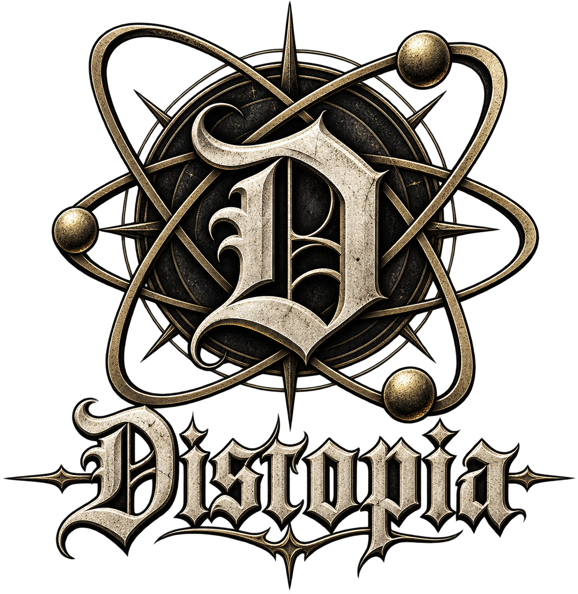

# 🎵 DYSTOPIA MUSIC

<div align="center">
  
  
  <h3>Un reproductor de música moderno, premium y futurista para Android</h3>

  <p>
    <a href="https://flutter.dev"></a>
    <a href="https://dart.dev"></a>
    <a href="https://developer.android.com"></a>
    <a href="https://github.com/Doker367/dystopia-music"></a>
    <a href="LICENSE"></a>
  </p>
</div>

---

## ⚡ Acerca de Dystopia

**DYSTOPIA** es un reproductor de música de alto rendimiento desarrollado en **Flutter** para **Android**, inspirado en una estética visual **Cyberpunk / Glassmorphic Neo-Dark**. Combina reproducción en segundo plano sin interrupciones, efectos de ecualización por hardware nativo, descarga de pistas offline con porcentaje en tiempo real y widgets dinámicos para la pantalla de inicio.

---

## ✨ Características Principales

* 🔍 **Búsqueda & Streaming Universal**: Motor de búsqueda abierto a cualquier artista, pista o género (Rock, Pop, Reggae, Hip-Hop, Rap, etc.) sin restricciones.
* 🎚️ **Efectos de Audio DSP por Hardware**:
  * **`HIFI 320K`**: Sonido de estudio con respuesta de frecuencia plana y rango dinámico completo.
  * **`BASS BOOST`**: Graves y sub-graves reforzados (+7 dB en $\le 300\text{ Hz}$) y pegada dinámica (+3.2 dB) impulsados por `AndroidEqualizer` y `AndroidLoudnessEnhancer`.
  * **`REVERB NEON`**: Escenario espacial cyberpunk con agudos cristalinos (+5 dB en $\ge 3000\text{ Hz}$) y calidez ambiental.
* 🔀 **Crossfade Automático (Fade)**: Transiciones suaves de entrada (2.5s) y salida (3.5s) entre canciones sin silencios molestos.
* 🛸 **Navbar Flotante con Cápsula Deslizante (*Slide to Switch*)**:
  * Cápsula neón que sigue fluidamente el dedo al deslizar horizontalmente de *Inicio* a *Ajustes*.
  * Física de resorte (`Curves.easeOutBack`) y respuesta háptica táctil en cada pestaña.
* 📥 **Descargas Offline Estilo Apple Music**:
  * Botón interactivo con animación circular de porcentaje real de progreso.
  * Gestión de almacenamiento local para reproducción 100% offline.
* 📱 **Widgets Interactivos para Android**:
  * Widgets para la pantalla de inicio en tamaños 1x2, 2x2 y Hub multimedia con controles de reproducción y actualización en tiempo real.
* 🎧 **Segundo Plano Continuo & MediaSession**:
  * Integración completa con `audio_service`: controles en barra de notificaciones, pantalla de bloqueo y compatibilidad con auriculares/Bluetooth.
  * Servidor proxy loopback local de alta velocidad para streaming estable y sin latencia.
* 🖤 **Estética Cyberpunk Glassmorphic**:
  * Fondos en negro profundo (`#0D0D0D`, `#121214`), acentos lima neón (`#A8B545`), desenfoques de vidrio en tiempo real (`BackdropFilter`) y renderizado fluido a 120 FPS (Impeller Vulkan).

---

## 🏗️ Arquitectura

DYSTOPIA implementa los principios de **Clean Architecture** y separación de responsabilidades:

```text
lib/
├── core/                   # Tema cyberpunk, constantes, servidores locales y utilidades
│   ├── services/           # Servidor local de streaming, permisos y widgets
│   ├── theme/              # Paleta de colores neón, gradientes y tipografías
│   └── utils/              # Formateadores de audio, debouncers y extensiones
├── domain/                 # Entidades puras y contratos de repositorios
│   ├── entities/           # Song, Artist, Album, Playlist, PlaybackState
│   └── repositories/       # Interfaces de repositorios (música, descargas, ajustes)
├── data/                   # Implementaciones de repositorios, DTOs y Hive
│   ├── models/             # Modelos serializables y adaptadores NoSQL
│   └── repositories/       # Persistencia local y acceso a proveedores
├── presentation/           # Capa visual (Flutter UI) y State Management
│   ├── screens/            # Home, Player, Explorar, Biblioteca, Descargas, Ajustes
│   ├── widgets/            # Navbar flotante, MiniPlayer, Artwork, AppleDownloadButton
│   └── providers/          # Controladores reactivos con Riverpod
├── player/                 # Motor de reproducción, ecualizador DSP y gestión de cola
│   ├── audio_player_service.dart   # BaseAudioHandler con AndroidEqualizer & LoudnessEnhancer
│   ├── player_controller.dart      # Notificador de estado de reproducción
│   └── queue_manager.dart          # Cola de canciones, shuffle y repeat
└── main.dart               # Punto de entrada, inicialización de Hive y AudioService
```

---

## 🚀 Instalación y Puesta en Marcha

### Prerrequisitos
* **Flutter**: 3.24+ (o superior)
* **Dart**: 3.5+
* **Android SDK**: API 24+ (Android 7.0 o superior)
* Dispositivo físico o emulador Android con Depuración USB activa.

### Pasos

1. **Clonar el repositorio**:
   ```bash
   git clone https://github.com/Doker367/dystopia-music.git
   cd dystopia-music
   ```

2. **Instalar dependencias**:
   ```bash
   flutter pub get
   ```

3. **Ejecutar en tu dispositivo**:
   ```bash
   flutter run
   ```

4. **Compilar APK Release**:
   ```bash
   flutter build apk --release
   ```
   El archivo generado se ubicará en: `build/app/outputs/flutter-apk/app-release.apk`.

---

## 👨‍💻 Créditos y Autoría

* **Creador y Desarrollador Principal**: **Alberto E. Grajales (Doker)**
  * **GitHub**: [@Doker367](https://github.com/Doker367)
  * **Repositorio**: [dystopia-music](https://github.com/Doker367/dystopia-music)

---

## 🌟 Libertad de Uso y Atribución

Este proyecto es de **código abierto** y libre para toda la comunidad:

* ✅ **Uso Libre**: Puedes descargar, compilar, modificar y utilizar este reproductor tanto para uso personal como para fines educativos o proyectos propios.
* 📌 **Solicitud de Atribución**: Si utilizas este proyecto, su código fuente, arquitectura, diseño o widgets como base o referencia para tus propios desarrollos, **te pedimos cordialmente que des la mención correspondiente a Doker y enlaces a este repositorio**:

```text
Basado en / Referenciado de Dystopia Music por Doker (@Doker367)
https://github.com/Doker367/dystopia-music
```

---

## 📄 Licencia

Este proyecto está bajo la Licencia **MIT** — consulta el archivo [LICENSE](LICENSE) para más detalles.
